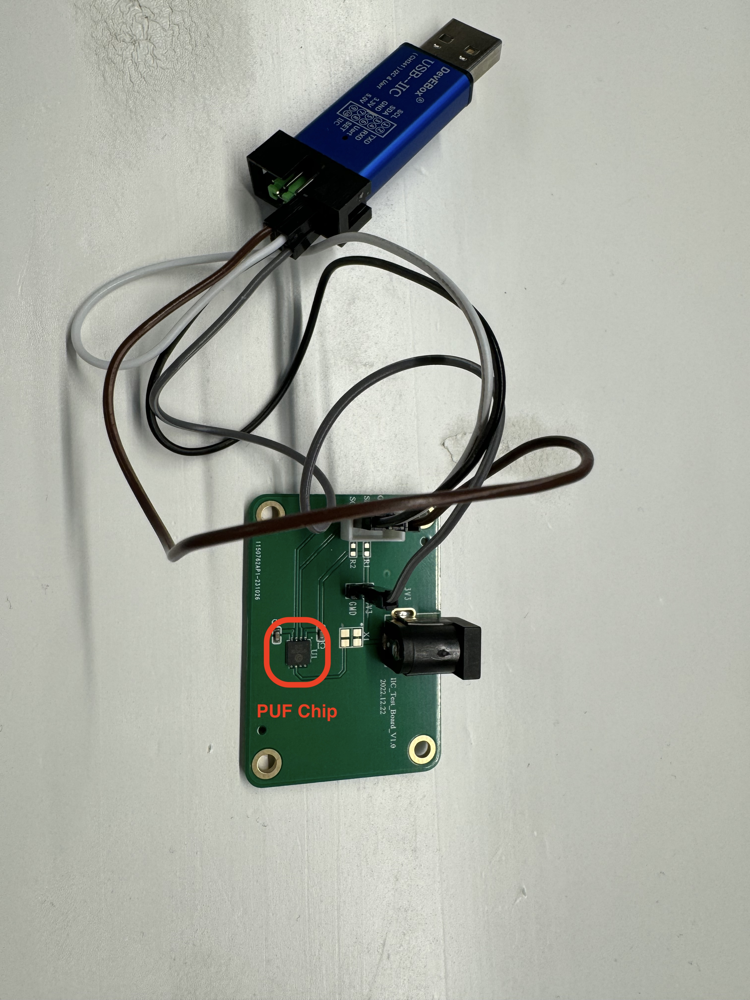

# Pebble with Armored Core

- [Original Repo of Let's Encrypt](https://github.com/letsencrypt/pebble)
- [Original README of Pebble](./README%20ORIGINAL.md)

## File Structure

- **ca**: main functions of Pebble CA, such as `New`, `newChain` and `makeRootCert`
- **cmd**: entry point of the entire project. This directory contains three main packages: `pebble`, `attestation` and `pebble-challtestsrv`
  - `pebble` contains the main workflow of the CA.
  - `attestation` is a standalone package of the attestation protocol between the CA and loggers.
- **pcert**: main functions of generating PUF-based certificates. Some code are ported from x509 package for our own modification.
- **putil**: some helper functions to enable a simluated PUF and define the data structure for PUF-based certificate issuing.
- **trclient**: functions of initializing and using a trillian client, and the data structure of PUF invocation entry.
- **other directories**: remain unchanged with the original repo.

## Deployment

> make sure that Go environment has been installed.

- `cd project_dir`
- `go install ./cmd/pebble`
- `~/go/bin/pebble -config ./test/config/pebble-config.json -treeid=SOME_TREE_ID`

Then the Pebble service with Armored Core should be running.

## What about PUF

- The completeness of CA's workflow is proritized in the prototype. Therefore, we define a simulated PUF struct `SimPUF` in the putil package to emulate the functionality of PUF. Since the interface of PUF is extremely similar to a hash function, we use SHA-256 and other operations to construct a software PUF function.

- Note that such simulation is only to complete the prototype development smoothly in a Golang project. It cannot be seen as the actual way of using PUF in practice.

## How to run the system?

See in [How-to-run](https://github.com/ArmoredCorePKI/Armored-Core/blob/main/README.md) 

## Remarks

- These code only demonstrate the functions of Pebble CA with Armored Core designed in the paper. They may be unstable and inappropiate for production tests.

- TODO:
  
  - Code cleanup 
  - Implementation Optimization

- How to measure the elapsed time?
  
  - Use the timing function : `Meas_Start_g` and `Meas_End_g` in the pcert package.

- PUF6 Figure
  - 
